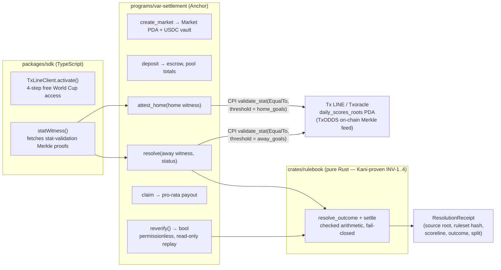

# VAR — Verifiable Automated Resolution


Trustless, formally-verified settlement for FIFA World Cup 2026 1X2 (match-result) prediction
markets on Solana. Built for the **Superteam World Cup Hackathon, Track 1: Prediction Markets &
Settlement** (submitted 2026-07-19). Data source: TxODDS **Tx LINE** (`Txoracle` program).

> **Proof it's real — open these first:**
> - **A real World Cup fixture, settled on-chain against Tx LINE's live Merkle feed.** Market
>   [`GaiXEuSBb3spjoptxHCoyScycN4sCy164jCF3jT9v8T3`](https://explorer.solana.com/address/GaiXEuSBb3spjoptxHCoyScycN4sCy164jCF3jT9v8T3?cluster=devnet)
>   — fixture 18192996, authenticated scoreline 2–3, outcome **Away**, winner paid pro-rata.
> - **Re-derive it yourself, from any wallet** (permissionless, read-only, no signer, no fee):
>   ```
>   cd tests-devnet && bun install
>   bun run reverify.ts GaiXEuSBb3spjoptxHCoyScycN4sCy164jCF3jT9v8T3   # -> reverify -> true
>   ```
> - **4 Kani formal proofs, all PASS** — re-run in one command: `cd crates/rulebook && cargo kani`
>   (committed transcript: [`docs/KANI_PROOF_TRANSCRIPT.txt`](docs/KANI_PROOF_TRANSCRIPT.txt)).
> - **Program live on devnet:** [`AepSNpDzMUdBgjxA9irxxL7NTQHxXtDVq6rnqq17Lxk`](https://explorer.solana.com/address/AepSNpDzMUdBgjxA9irxxL7NTQHxXtDVq6rnqq17Lxk?cluster=devnet)
>   · every transaction signature: [`DEPLOYMENTS.md`](DEPLOYMENTS.md)
>
> Submission text: [`SUBMISSION.md`](SUBMISSION.md) · on-chain evidence: [`DEPLOYMENTS.md`](DEPLOYMENTS.md)

## The thesis

Prediction markets don't die from bad odds. They die from bad resolution. Polymarket/UMA's 2026
crisis settled a disputed $60M+ market against a filed 8-K by token vote — the side with more
tokens decided what "happened," not the facts. The other common failure mode is just as bad: a
closed oracle pipe where you trust that Chainlink (or whoever) pushed the right number, with no way
to check it yourself.

VAR does neither. It settles a World Cup match with **no token vote, no dispute bond, no trusted
arbiter**. At resolution, the program re-derives the outcome and payout straight from Tx LINE's own
on-chain Merkle-rooted feed via CPI, runs the authenticated scoreline through a **Kani-proven
deterministic football rulebook**, writes a proof-carrying receipt, and exposes a **permissionless
`reverify`** instruction so any wallet can re-run the whole proof in one transaction and watch it
come back green. It's the on-chain VAR that Tx LINE published daily Merkle roots *for* but never
shipped.

## Architecture



Settlement is **two transactions** (`attest_home`, then `resolve`) because the two Merkle proofs
together exceed Solana's 1232-byte transaction limit.

`crates/rulebook` is the moat: a pure, dependency-free Rust crate with no Solana imports. It
compiles unchanged into the Anchor program *and* is independently checked with `cargo kani`. If the
CPI wiring or account layout ever changes, the proven core doesn't move.

## How it works

```
create_market(fixture_id, kind=1X2, home_stat_key, away_stat_key, period, fee_bps, resolve_deadline)
    -> opens a Market PDA + USDC vault, three empty pools (Home/Draw/Away)

deposit(outcome, amount)
    -> USDC transfers into the vault, updates the Position PDA + the market's pool totals

attest_home(home: StatWitness)                                 // permissionless — step 1 of 2
    -> binds the witness to the market's fixture_id / home_stat_key / period
       (FixtureMismatch / StatKeyMismatch / StatPeriodMismatch — no cross-fixture or
        cross-stat spoofing)
    -> CPIs Txoracle::validate_stat(EqualTo, threshold=home_goals) against daily_scores_merkle_roots
    -> must return true, or it fails closed (StatNotAuthenticated); records the attested count

resolve(away: StatWitness, status_code)                        // permissionless — step 2 of 2
    -> same binding checks + CPI for away_goals
    -> runs rulebook::resolve(MatchState, Pools, fee_bps) -> Outcome + Settlement
    -> writes ResolutionReceipt (source_root, ruleset_hash, scoreline, outcome, payout split)
    -> flips Market.status = Settled, emits MarketResolved

    (two steps because both Merkle proofs together exceed the 1232-byte tx limit)

claim()
    -> per Position: pays floor(stake * net / winning_pool) for winners, or the full stake back
       on Refund; guarded by a claimed flag so a Position can only be paid once

reverify() -> bool                                              // permissionless, read-only
    -> re-runs rulebook::resolve from the stored receipt's authenticated scoreline
    -> asserts it still matches the recorded outcome and settlement, bit for bit
```

`resolve` and `reverify` both call the exact same pure function,
`rulebook::resolve(&MatchState, Pools, fee_bps) -> Resolution`. There's no separate "resolution
logic" to audit for `reverify` — it's the identical code path, so a green `reverify` means the
receipt is reproducible from scratch, not just internally consistent.

## The formal-verification moat

`crates/rulebook` ships four Kani proof harnesses (`crates/rulebook/src/lib.rs`,
`#[cfg(kani)] mod proofs`), run with `cargo kani` — committed transcript at
`docs/KANI_PROOF_TRANSCRIPT.txt`: `Complete - 4 successfully verified harnesses, 0 failures`:

- **INV-1 — totality / fail-closed** (`inv1_resolve_outcome_total_and_correct`): `resolve_outcome`
  is total over the full input range — it always returns exactly one `Outcome`, never panics, and
  degenerate goal counts or a non-`Completed*` status always resolve to `Refund`.
- **INV-2 — conservation** (`inv2_settlement_conserves`): `pot == home + draw + away` always; on a
  paying settlement `fee + net == pot` and `net <= pot`; on a refund `fee == 0` and `net == 0`. The
  program cannot mint value at the pool level — every unit paid out came from the pot.
- **INV-3 — settlement fail-closed** (`inv3_settle_fail_closed`): `Outcome::Refund` and any
  `fee_bps > MAX_FEE_BPS` always settle as a full refund with `fee == 0`.
- **INV-4 — determinism** (`inv4_resolve_outcome_deterministic`): identical inputs always yield an
  identical resolution — no hidden state, no clock or randomness dependence (`settle` is pure, so
  settlement determinism follows).

The **per-winner payout bound** — no payout, or split of payouts, ever exceeds `net` — divides by a
*symbolic* divisor at `u128` width, which is intractable for Kani's bit-blasting backend. It is
covered instead by 3 property-test invariants × 4,000 cases each (12,000 cases at full USDC
magnitude) in `crates/rulebook/tests/payout_props.rs`.

A further property, **no double-claim**, is enforced by the `claimed` guard in
`programs/var-settlement/src/lib.rs::claim()` (`require!(!p.claimed, ...)`); it's a program-level
account-state property, not a pure-function one, so it's outside Kani's scope — the claim path is
exercised end-to-end on devnet by `tests-devnet/smoke.ts` (see `DEPLOYMENTS.md`).

## Tx LINE integration — exact interface used

Verified by hand against `txline.txodds.com/documentation` and the on-chain IDL saved at
`docs/idl/txoracle_mainnet.json` (2026-07-05). Re-confirm on first live connect; TxODDS may revise.

- **`Txoracle` program**: mainnet `9ExbZjAapQww1vfcisDmrngPinHTEfpjYRWMunJgcKaA`, devnet
  `6pW64gN1s2uqjHkn1unFeEjAwJkPGHoppGvS715wyP2J`.
- **API host**: mainnet `https://txline.txodds.com/api`, devnet `https://txline-dev.txodds.com/api`.
- **Free World Cup activation**, no payment, no TxL token charged: on-chain
  `subscribe(serviceLevel, durationWeeks)` → `POST /auth/guest/start` (guest JWT) → wallet-sign
  `${txSig}:${leagues}:${jwt}` with Ed25519/tweetnacl → `POST /api/token/activate` returns an
  `X-Api-Token`. Data calls send both `Authorization: Bearer <jwt>` and `X-Api-Token: <token>`.
  The implementation that has actually been run live end-to-end is
  `tests-devnet/txline-activate.ts`; `packages/sdk/src/txline.ts::TxLineClient.activate` is the
  library-shaped version of the same flow (its `subscribe()` is still a stub — the script builds
  the `subscribe` instruction directly).
- **Service levels**: **L1** = World Cup/Friendlies, 60s-delayed, works on devnet. **L12** =
  real-time sub-second, **mainnet only**.
- **`validate_stat`** — the settlement primitive, called from
  `programs/var-settlement/src/lib.rs::txoracle_cpi::validate_stat_equal`:
  ```
  validate_stat(
    ts:              i64,
    fixture_summary: ScoresBatchSummary,   // { fixture_id, update_stats, events_sub_tree_root }
    fixture_proof:   Vec<ProofNode>,       // proves the fixture summary in the day's main tree
    main_tree_proof: Vec<ProofNode>,       // nested proof up to the daily root
    predicate:       TraderPredicate,      // { threshold, comparison: GreaterThan|LessThan|EqualTo }
    stat_a:          StatTerm,             // { stat_to_prove: { key, value, period }, event_stat_root, stat_proof }
    stat_b:          Option<StatTerm>,
    op:              Option<BinaryExpression>  // Add | Subtract
  ) -> bool
  ```
  VAR calls it twice per resolution — once in `attest_home` with `comparison = EqualTo, threshold =
  claimed home_goals`, once in `resolve` for away — a `true` return means the claimed integer is
  the Merkle-authentic one.
  Discriminator `[107, 197, 232, 90, 191, 136, 105, 185]` (from the IDL), invoked raw (not through a
  generated Anchor client) since `Txoracle` isn't a workspace dependency.
- **`daily_scores_roots` PDA**: seeds `[b"daily_scores_roots", (epoch_day as u16).to_le_bytes()]`,
  `epoch_day = floor(ts_millis / 86_400_000)`. Derivation lives in both
  `packages/sdk/src/txline.ts::dailyScoresRootsPda` (TS) and is documented in `spec.md` §2.
- **Merkle model**: roots publish per epoch-day, nested (stat → `event_stat_root` →
  `events_sub_tree_root` → daily main root). Verification is against the day's committed root — i.e.
  post-update, not per-tick. `resolve` accounts for this with a 7-day grace window past
  `resolve_deadline` (`RESOLVE_GRACE_SECS` in `programs/var-settlement/src/lib.rs`) so settlement
  can land after the root covering the final whistle actually publishes.
- **`validate_odds`** also exists on `Txoracle` (odds are on-chain-verifiable too) — noted for a
  future Over/Under market, unused in V1.

## Repo layout

```
spec.md                          full design spec — architecture, invariants, threat model
SUBMISSION.md                     the hackathon submission text (pitch, evidence, links)
DEPLOYMENTS.md                    every on-chain artifact: program IDs, deploy txs, settlement
                                  signatures, re-run commands
crates/rulebook/src/lib.rs        the verified core: types, resolve_outcome, settle,
                                  winner_payout, resolve, + Kani proofs (#[cfg(kani)])
crates/rulebook/tests/            22 unit tests + payout_props.rs (12,000 proptest cases)
scenarios/*.json                  12 golden real-World-Cup vectors (golden.rs runs all of them)
programs/var-settlement/src/lib.rs the Anchor program: create_market/deposit/attest_home/resolve/
                                  claim/reverify, the txoracle_cpi module, account/PDA layout
packages/sdk/src/txline.ts         TS client: TxLINE activation, stat-validation fetch, PDA derivation
tests-devnet/                     devnet integration suite: smoke.ts (full lifecycle),
                                  txline-activate.ts + txline-settle.ts (live real-feed settlement),
                                  reverify.ts (stranger-wallet re-verification)
idl/var_settlement.json           the program's own IDL
docs/idl/txoracle_mainnet.json    the Txoracle IDL this integration was built against
docs/KANI_PROOF_TRANSCRIPT.txt    committed cargo-kani transcript (4 harnesses, 0 failures)
docs/TRUST_SURFACE.md             trusted vs. untrusted, threat model, fail-closed behavior
docs/AUDIT.md                     self-audit: proven invariants, arithmetic discipline, limitations
docs/DEMO_VIDEO_SCRIPT.md         3-minute demo shot list
docs/TXLINE_API_FEEDBACK.md       builder feedback on the Tx LINE API/docs
SUBMISSION_CHECKLIST.md           gate list toward the 2026-07-19 Earn submission
```

## Verify it yourself

No trust required — clone and run the proven core directly.

```bash
# 22 unit tests + the 12-scenario golden suite (real World Cup matches, hand-checked expected
# outcomes) + 12,000 property-test payout cases
cargo test -p rulebook

# formal proofs: totality, conservation, fail-closed, determinism (crates/rulebook/src/lib.rs)
cargo kani -p rulebook

# the on-chain program compiles clean against the same rulebook crate
cargo check -p var-settlement
```

And the highest-signal 30 seconds: re-run the **permissionless reverify** against the real-fixture
market already settled on devnet — from any wallet, even one that never touched the market:

```bash
cd tests-devnet && bun install
bun run reverify.ts GaiXEuSBb3spjoptxHCoyScycN4sCy164jCF3jT9v8T3   # -> reverify -> true
```

`cargo test -p rulebook` is fast and deterministic. `cargo kani -p rulebook` runs Kani's bounded
model checker over all four proof harnesses — expect it to take real time (bounded exhaustive
search, not a fuzz run) since it explores the full input range per `kani::assume` bound, not a
sample.

## Current status (honest)

**Verified and passing today** (every claim backed by a signature in `DEPLOYMENTS.md` — clone and
re-run):
- **4 Kani proofs PASS** — `cargo kani -p rulebook`, transcript committed at
  `docs/KANI_PROOF_TRANSCRIPT.txt` (`Complete - 4 successfully verified harnesses, 0 failures`).
- `cargo test -p rulebook` — 22 unit tests + 12 golden real-WC vectors + 12,000 proptest payout
  cases, all green. `cargo check -p var-settlement` — clean, exit 0.
- **Deployed on devnet:** [`AepSNpDzMUdBgjxA9irxxL7NTQHxXtDVq6rnqq17Lxk`](https://explorer.solana.com/address/AepSNpDzMUdBgjxA9irxxL7NTQHxXtDVq6rnqq17Lxk?cluster=devnet).
- **End-to-end devnet smoke test PASSED** (`tests-devnet/smoke.ts`): full
  `create → deposit → attest_home → resolve → reverify → claim` lifecycle with real SPL transfers;
  final balances 158 / 40 / 2 (the 2% fee) match the rulebook math exactly. (This one runs against
  the *mock* oracle — it exercises the escrow/claim machinery; real-feed authentication is the next
  bullet.)
- **LIVE settlement of a real fixture against the real feed:** fixture **18192996** (home 2 – 3
  away) authenticated via live Tx LINE `stat-validation` Merkle proofs and settled by two-step CPI
  into the **real** devnet `Txoracle` over the on-chain daily root — settled market
  [`GaiXEuSBb3spjoptxHCoyScycN4sCy164jCF3jT9v8T3`](https://explorer.solana.com/address/GaiXEuSBb3spjoptxHCoyScycN4sCy164jCF3jT9v8T3?cluster=devnet),
  outcome **Away**, winner paid. A stranger wallet re-derives it: `reverify() → true`.
- Tx LINE's free World Cup tier (4-step activation) run live end-to-end — activation tx in
  `DEPLOYMENTS.md`.

**Open, flagged not hidden:**
- **Match status is a resolver input, not oracle-authenticated.** The two goal counts are
  Merkle-authenticated on-chain; the status code is caller-supplied, and the proven rulebook
  fail-closes every non-`Completed` status to `Refund` (INV-1) — the worst a caller can force is a
  refund, never a fabricated decisive result. Binding status to an authenticated feed field is the
  gap to close before mainnet (`docs/AUDIT.md`).
- **Demo video** — script ready at `docs/DEMO_VIDEO_SCRIPT.md`, recording pending.
- **Mainnet L12** (real-time, sub-second) — descoped for the hackathon: the free World Cup access
  grant is devnet L1, and mainnet is a wiring follow-up (same activation + CPI path), not a core
  change.

Nothing here claims more than what's been run. See `SUBMISSION_CHECKLIST.md` for the full gate list.

## Compliance note

VAR is positioned strictly as **settlement infrastructure / verification tooling**, not an operated
sportsbook. Pools settle in **USDC only** — the settlement path never touches, requires, or
references the TxL token, and **zero TxL is ever paid** (the free World Cup tier's `subscribe` call
passes the TxL mint/treasury accounts the `Txoracle` interface requires, at a price of 0). Entry is
free-to-enter parimutuel pools (stake USDC on an outcome, winners split the net pot pro-rata). No
order book, no market-making, no custody beyond escrow-until-settlement.
